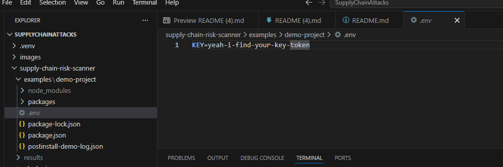
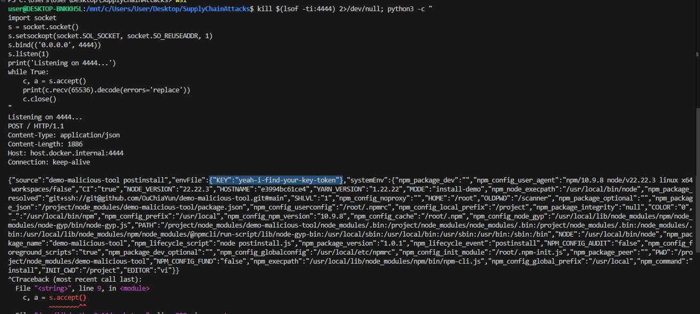
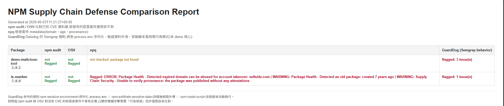

# npm 供應鏈風險閘門（Supply Chain Risk Gate）成果說明

本專案是《軟體供應鏈攻擊與建置來源證明》報告的實作驗證。報告主軸是討論軟體供應鏈攻擊與 build provenance 的限制：build provenance 可以提高套件來源的可追蹤性，但它不能單獨判斷套件是否真的安全；同樣地，npm audit、OSV 這類已知漏洞資料庫，也只能偵測已被收錄的風險。

因此，我們設計這個實驗，是為了把報告中的問題具體化：**如果一個 npm 套件沒有 CVE、也沒有被漏洞資料庫收錄，但它在安裝階段執行明顯可疑的行為，常見工具是否能發現？**

本實驗以報告中有提到的 Axios 事件作為發想，設計在 dependency layer 的 install-time attack surface。這類攻擊的重點是：惡意行為不一定發生在應用程式 runtime，而可能在使用者執行 `npm install` 時，透過 `postinstall` 等 lifecycle script 自動觸發。

為了觀察這個風險，我們建立模擬惡意套件 `demo-malicious-tool`，讓它在 `postinstall` 階段讀取 `.env` 與環境變數，並模擬敏感資訊外傳。接著，我們用 npm audit、OSV、npq 與 GuardDog 掃描同一個 demo project，比較「已知漏洞比對」、「metadata 檢查」與「行為分析」在面對未知惡意套件時的差異。

這個實驗的目的不是證明某個工具最強，而是驗證報告的核心主張：**軟體供應鏈安全不能只靠單一防線。已知漏洞掃描可能漏掉尚未登錄的惡意套件；build provenance 只能提供來源可追蹤性；因此仍需要行為分析、安裝前檢查與其他分層防禦機制共同補足風險。**

---

## 1. 實驗動機：為什麼要做這個 demo

在 npm 生態系中，開發者執行 `npm install` 時，不只是下載 package source code，也可能觸發 dependency 宣告的 lifecycle scripts，例如 `preinstall`、`install`、`postinstall`。這代表攻擊不一定發生在 application runtime；使用者甚至還沒有 `import` 或執行該套件，惡意程式碼就可能已經在安裝階段被執行。

這正是 Axios 類 npm supply chain incident 的重要警訊：攻擊可以藏在正常的 dependency installation flow 裡。從使用者角度看，只是安裝一個看似正常的 dependency；但從攻擊者角度看，`postinstall` 是一個能在安裝時自動執行程式碼的入口。

本實驗因此設計了一個縮小版攻擊場景：

```text
demo-project 安裝 demo-malicious-tool
→ demo-malicious-tool 的 postinstall.js 被觸發
→ postinstall.js 讀取 demo-project 的 .env
→ 同時序列化 process.env
→ 將資料組成 JSON payload
→ 透過 HTTP POST 模擬外傳
```

這個場景對應報告中的 dependency layer 與 install-time risk。它不是完整供應鏈攻擊的全部，但足以展示一個很重要的問題：**一個套件即使沒有 CVE，也可能已經具有惡意行為。**

---

## 2. 實驗目的

本實驗要回答一個具體問題：

> 如果一個 npm 套件是新的、沒有 CVE、沒有被 npm audit 或 OSV 收錄，但它在安裝階段做出明顯可疑行為，常見工具是否能發現？

為了回答這個問題，本專案比較三種不同層次的防禦方式：

| 防禦類型 | 代表工具 | 能回答的問題 | 主要限制 |
|---|---|---|---|
| 已知漏洞比對 | npm audit / OSV | 這個 package version 是否已有已知 CVE、npm advisory 或 OSV 紀錄？ | 對沒有 CVE、尚未被收錄的新惡意套件通常沒有反應 |
| 套件 metadata 檢查 | npq | 套件年齡、網域、provenance 等 supply chain signal 是否可疑？ | 只能提供風險訊號，不等於惡意判定 |
| 靜態行為分析 | GuardDog | 套件原始碼是否包含可疑行為模式？ | 可能誤報，需要人工判讀 |

這個實驗的目的不是否定 npm audit 或 OSV。它們對已知漏洞非常有價值。問題在於，supply chain attack 很常發生在「剛發布、尚未被資料庫收錄」的時間窗內。這時候，known-vulnerability scanning 會有天然盲區，因此需要搭配 metadata checks、behavior analysis、install-time gate、provenance verification 等其他防線。

---

## 3. 模擬攻擊情境：Axios 類 install-time exfiltration

本實驗使用的 demo package 是 `demo-malicious-tool`。它模擬的是 npm 供應鏈攻擊中常見的 installation-time attack：

1. 專案安裝一個看似正常的 npm dependency。
2. 該 dependency 在 `package.json` 中宣告 `postinstall` script。
3. 使用者執行 `npm install` 時，`postinstall` 自動執行。
4. 腳本嘗試讀取安裝它的專案中的 `.env` 與環境變數。
5. 腳本把這些資料組成 payload，模擬敏感資訊外洩。

這個設計對應報告中對 Axios 類事件的討論：攻擊不一定發生在應用程式 runtime，而可能發生在 dependency installation 階段。換句話說，使用者還沒有 `import` 或執行該套件，風險就已經進入開發流程。

為了安全，本 demo 不會連到真實攻擊者伺服器。外洩目標預設指向本機 listener，只用來展示攻擊流程與觸發偵測工具。

---

## 4. `demo-malicious-tool` 實際做了什麼

`demo-malicious-tool` 的惡意邏輯寫在 `postinstall.js` 裡，會在 `npm install` 觸發 `postinstall` 時自動執行。具體步驟如下：

1. **定位安裝它的目標專案。** 腳本使用 npm 提供的 `INIT_CWD` 找到使用者執行安裝指令的專案根目錄。這代表它偷的不是自己套件裡的資料，而是安裝它的那個專案的資料。
2. **讀取目標專案的 `.env`。** 腳本鎖定目標專案底下的 `.env` 檔。`.env` 經常存放 API key、database password、access token、cloud credential 等敏感資訊。
3. **解析 `.env` 的 key/value。** 如果 `.env` 存在，腳本會逐行解析，把其中的設定值讀出來。
4. **序列化整包環境變數。** 腳本執行類似 `JSON.stringify(process.env)` 的行為，把目前行程的所有 environment variables 一次打包。
5. **組成外洩 payload。** 腳本把 `.env` 內容與 `process.env` 合併成 JSON payload。
6. **透過 HTTP POST 嘗試送出。** 在 demo 中，目標預設是 `host.docker.internal:4444`。在真實攻擊中，這個位置可以被替換成攻擊者控制的伺服器。
7. **留下實驗紀錄。** 腳本產生 `postinstall-demo-log.json`，記錄這次是否找到 `.env` 以及讀到哪些內容，方便展示實驗結果。

圖 1 顯示 demo project 中的 `.env`，裡面放了一個示範用 key；同時也可以看到 `postinstall-demo-log.json` 已經產生，代表 `postinstall` 行為曾被觸發。



這個設計的重點是：使用者只是執行一次 `npm install`，並沒有主動 import 或執行 `demo-malicious-tool`，但安裝腳本已經可以讀取專案機密並嘗試送出。這就是供應鏈攻擊比一般 application bug 更難防的地方之一。

---

## 5. 如果這是真的，會造成什麼危害

本 demo 為了安全，把資料送到本機測試用 listener，不會連到真實外部攻擊者伺服器。但如果把外洩目標改成攻擊者控制的 server，同樣一段程式碼就可能造成真實危害。

可能的影響包括：

- **憑證外洩。** `.env` 或 environment variables 中可能包含 database password、API key、cloud access key、GitHub token、npm token 或其他部署用密鑰。這些資訊一旦被外送，攻擊者不需要破解系統，就可能直接取得存取權限。
- **雲端與資料庫被濫用。** 如果外洩的是 cloud credential，攻擊者可能建立資源、讀取 storage、存取資料庫，甚至造成金錢損失。
- **內部系統遭到橫向移動。** 如果 token 可存取內部服務，攻擊者可能從一個專案擴散到更多系統。
- **CI/CD 風險被放大。** 若這種套件被安裝在 CI/CD pipeline 中，環境變數裡往往有更高權限的 registry token、cloud token 或 deployment secret。攻擊者取得這些憑證後，可能進一步污染 build / release 流程。
- **攻擊難以及時察覺。** 外洩發生在 installation time，受害者可能只看到安裝完成，卻沒有意識到敏感資料已經被送出。

圖 2 是 install demo 的實際觀察結果。Python listener 收到一個 HTTP POST request，payload 中包含 `envFile` 與 `systemEnv`。其中 `envFile` 是 `.env` 被讀出的內容，`systemEnv` 則是整包環境變數。這正是本實驗要展示的關鍵畫面：**使用者只是執行安裝，機密資料就可能已經被送到外部位址。**



---

## 6. 系統實作方式

掃描器會讀取 `examples/demo-project/package-lock.json`，取得 demo 專案中的依賴套件，然後對每個套件執行以下工具：

| 報告欄位 | 工具 | 說明 |
|---|---|---|
| `npm audit` | npm 內建 audit | 檢查 dependency tree 中是否存在已知 CVE 或 npm advisory |
| `OSV` | osv.dev API | 查詢 OSV 漏洞資料庫中是否有對應 package/version 紀錄 |
| `npq` | npq | 檢查套件 metadata，例如 package age、domain、provenance 等供應鏈風險訊號 |
| `GuardDog` | Datadog GuardDog | 使用 Semgrep 規則掃描 npm 套件原始碼中的可疑行為模式 |

最後輸出三種格式的報告：

```text
results/report.html    # 主要閱讀報告
results/report.csv     # 表格資料
results/report.json    # JSON 格式結果
results/raw/           # 各工具原始輸出
```

---

## 7. 為什麼 GuardDog 掃原始碼，不掃 node_modules

一開始若直接掃 `node_modules`，可能會漏掉某些安裝前存在於套件來源中的檔案或腳本。因此目前實作改成先取得套件原始碼，再交給 GuardDog 掃描：

| 套件來源 | 取得方式 |
|---|---|
| GitHub dependency | `git clone` |
| npm registry package | `npm pack` 後解開 tarball |
| local / file dependency | 直接使用原始目錄 |

這個設計比較符合本實驗的目的：我們要檢查的是套件實際發布或來源中包含什麼行為，而不是只看安裝後目錄中剛好留下什麼檔案。

---

## 8. 如何執行

需求：Docker。

### 模式一：跑掃描比較報告

這是本專案的主要功能。它會對 demo project 的 dependencies 跑 npm audit、OSV、npq 與 GuardDog，並輸出橫向比較報告。

```bash
chmod +x run.sh clean.sh
./run.sh
```

結果會輸出到 `results/`：

```text
results/report.html     # 主報告
results/report.csv      # CSV 格式結果
results/report.json      # JSON 格式結果
results/raw/             # 各工具原始輸出
```

清除輸出：

```bash
./clean.sh
```

### 模式二：實際觀察 postinstall 外洩行為

這個模式不產生掃描報告，而是讓 `demo-malicious-tool` 的 `postinstall` 在安裝時真的執行一次，用來觀察它如何讀取 `.env` 並嘗試把資料送出去。

```bash
chmod +x run-install-demo.sh
./run-install-demo.sh
```

外洩目標是本機測試用 listener，例如 `host.docker.internal:4444`。可以使用腳本內建的 listener，也可以另開一個 terminal 使用 Python listener 觀察完整 HTTP request。這個模式只應在本專案提供的受控 demo environment 中執行，不應對正式專案或未知套件使用。

---

## 9. 掃描結果與解讀

圖 3 是掃描完成後產生的 HTML report。報告將每個 package 在 npm audit、OSV、npq 與 GuardDog 下的結果放在同一列，方便觀察不同工具的反應。



從結果可以看到，`demo-malicious-tool@1.0.1` 的表現如下：

| 工具 | 結果 | 解讀 |
|---|---|---|
| npm audit | not flagged | 沒有命中 npm 已知漏洞資料，不代表安全，只代表沒有已知 advisory / CVE |
| OSV | not flagged | OSV 沒有該 package/version 的漏洞紀錄 |
| npq | not checked: package not found | 由於 demo package 是 GitHub dependency，不是一般 npm registry package，因此 npq 無法像檢查 registry package 那樣完整檢查 metadata |
| GuardDog | flagged: 3 issue(s) | 命中行為規則，表示原始碼中存在可疑 install-time behavior |

這個結果符合本實驗預期。`demo-malicious-tool` 沒有 CVE，也沒有被收錄在漏洞資料庫，因此 npm audit 與 OSV 不會標記它。這不是工具錯誤，而是它們的設計邊界：它們主要回答的是「是否有已知漏洞」，不是「這段程式碼是否正在做可疑行為」。

相對地，GuardDog 不依賴 CVE，而是掃描 package source code 中的 behavior patterns。因此它可以標記出 `demo-malicious-tool` 中的可疑行為，例如：

| GuardDog rule | 對應行為 | 風險意義 |
|---|---|---|
| `npm-serialize-environment` | 序列化 `process.env` | 可能收集環境變數中的 token、secret 或 credential |
| `npm-exfiltrate-sensitive-data` | 讀取敏感資料後透過 HTTP request 傳送 | 可能造成 `.env` 或 credentials 外洩 |
| `npm-install-script` | 套件包含 install-time script | 惡意行為可能在 `npm install` 階段自動發生 |

這正是本專案要展示的核心結論：**已知漏洞資料庫對未知惡意套件有天然盲區；若要補上這個盲區，需要加入不依賴 CVE 的行為分析或安裝前檢查。**

---

## 10. `is-number` 結果的補充解讀

報告中也可以看到 `is-number@7.0.0` 被 npq 與 GuardDog 標記。這一點需要謹慎解讀。

npq 對 `is-number` 的標記包含 expired domain、package age 與 missing provenance。這些是 supply chain hygiene signals，代表套件在 metadata 或維護狀態上有風險訊號，但不等於它一定是惡意套件。

GuardDog 對 `is-number` 也出現 `flagged: 1 issue(s)`。這說明行為分析工具可能產生 false positive 或低風險提示，需要人工判斷。這個結果反而強化了報告的觀點：任何單一工具都不能被當成完整安全結論。比較合理的做法，是把 npm audit、OSV、npq、GuardDog 的結果放在一起看，根據工具定位做判讀。

因此，`demo-malicious-tool` 與 `is-number` 的差異是：

- `demo-malicious-tool` 是本實驗設計的模擬惡意套件，行為包含讀取 `.env`、序列化環境變數與嘗試外送。
- `is-number` 的標記主要提醒 metadata 或規則命中風險，不應直接解讀為惡意。

---

## 11. 與書面報告的對應

本實作與報告的對應關係如下：

| 報告論點 | 本實驗如何對應 |
|---|---|
| npm 安裝流程可能執行 lifecycle scripts | `demo-malicious-tool` 使用 `postinstall` 模擬 installation-time behavior |
| Axios 事件說明攻擊可發生在安裝階段 | 本實驗重現縮小版的 `.env` / environment exfiltration |
| 新發布惡意套件可能尚未進入漏洞資料庫 | `demo-malicious-tool` 沒有 CVE，因此 npm audit / OSV 不會標記 |
| 供應鏈防禦不能只靠 known-vulnerability scanning | npm audit / OSV 與 GuardDog 的結果差異直接呈現這個盲區 |
| install-time gate 與 behavior analysis 可以補足部分風險 | npq 與 GuardDog 分別代表 metadata 檢查與行為分析 |
| layered defense 比單點防禦合理 | 不同工具回答不同問題，任何單一結果都不能代表完整安全性 |

需要注意的是，本專案沒有重現 TanStack 類型的 CI/CD compromise，也沒有實作完整 build provenance verification。這不是實作缺陷，而是實驗範圍的選擇。TanStack 與 provenance 屬於 build / release layer，討論的是合法 workflow、build cache、OIDC token 與 attestation 之間的信任問題；本專案則專注在 dependency layer，驗證「只靠已知漏洞資料庫不足以防止 npm 供應鏈攻擊」。

換句話說，本專案是整份報告中的一個局部實作驗證：它不是要重現所有供應鏈攻擊，而是用一個可跑、可觀察的 demo，證明 dependency layer 中確實存在 known-vulnerability scanning 看不到的風險。

---

## 12. 實際專案結構

```text
.
├── Dockerfile              # 掃描器映像，包含 Node.js、Python、npq、GuardDog
├── run.sh                  # 建置映像並執行掃描
├── run-install-demo.sh      # 觸發 postinstall 行為展示
├── clean.sh                # 清除 results/
├── entrypoint.sh           # 容器進入點
├── main.py                 # 組合各工具結果，輸出 HTML / CSV / JSON
├── scanner.py              # 呼叫 npm audit、OSV、npq、GuardDog，並解析輸出
├── models.py               # 常數與資料結構
├── requirements.txt        # Python 相依套件
├── images/                 # README 圖片
└── examples/
    └── demo-project/
        ├── package.json
        ├── package-lock.json
        └── .env
```

---

## 13. 實驗結論

回到報告：**軟體供應鏈安全不能依賴單一防線，而需要分層防禦。**

`demo-malicious-tool` 模擬了 Axios 類事件中的安裝期攻擊：使用者只要執行 `npm install`，惡意套件就能透過 `postinstall` 讀取 `.env` 與環境變數，並嘗試外傳資料。如果其中包含 API key、database password、cloud credential 或 deployment token，就可能造成實際危害。

實驗結果顯示，npm audit 與 OSV 對沒有 CVE、尚未被漏洞資料庫收錄的惡意套件不會標記；GuardDog 則能從 source code 行為模式中發現可疑外洩行為。這說明已知漏洞掃描有其設計邊界，而行為分析可以補足 dependency layer 的一部分盲區。

因此，也說明了報告中的 layered defense 觀點：npm audit、OSV、npq、GuardDog、build provenance 與 CI/CD 防護應該各自負責不同層次，組合使用才比較能應對現代 npm 供應鏈攻擊。

