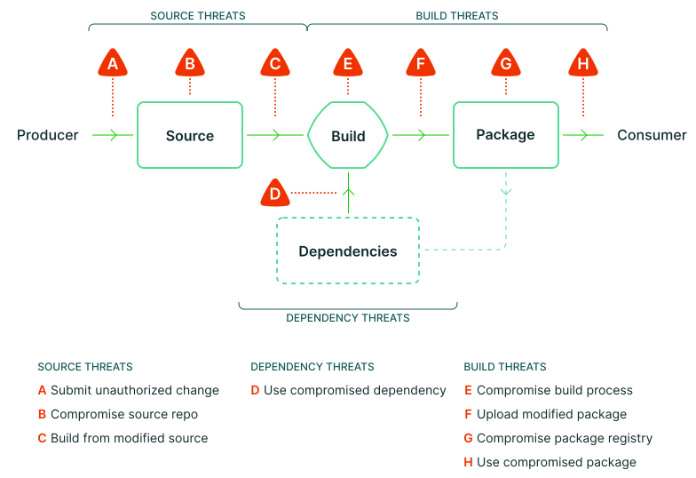
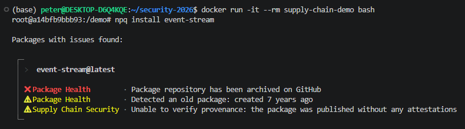
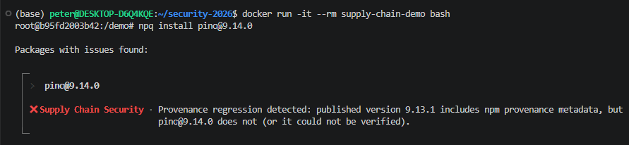

<!-- _paginate: false -->
<!-- _class: lead -->

# Software Supply Chain Attacks
## Build Provenance

NG, Chun Sing (r14922186)
OU, Chia-Yun (r14922072) 

---

# Our Daily Routine

Every day, developers run:

```
npm install   pip install   mvn install   conda install
```

These download and execute **third-party code** — one dependency can pull in **dozens of transitive packages** — without inspection.

**Do we ever verify they haven't been tampered with?**

---

# Background

<!-- **TODO1 — SSC definition from NIST / OWASP** -->

According to **NIST**, a Software Supply Chain (SSC) is:

> "a collection of steps that create, transform, and assess the quality and policy conformance of software artifacts."

In practice, SSC covers the whole software development process, including source code, third-party dependencies, version control systems, build tools, CI/CD pipelines, and package registries.

A **software supply chain attack** occurs when an attacker compromises one trusted part of this chain, such as a dependency, maintainer account, build cache, or CI/CD workflow.

Instead of attacking the final application directly, the attacker abuses the trust between developers, tools, packages, and registries. Because one package can be reused by many downstream projects, a single compromise can spread widely.


---

# Why SSC Became a Top Risk

<!-- **TODO2 — Why this problem matters** -->
<!-- TODO3 — Financial loss / business impact -->

OWASP Top 10:2025 ranks **Software Supply Chain Failures** as **A03**.

This reflects a shift in modern software risk:

- applications rely on many third-party components
- package managers automatically resolve transitive dependencies
- CI/CD pipelines build and publish software artifacts
- one compromised upstream component can affect many downstream users

Software supply chain security is therefore not only about code vulnerabilities, but also about **trust in dependencies, build systems, maintainers, and registries**.


---


<!-- **TODO2 — OWASP Top 10 methodology** -->

OWASP Top 10:2025 is **data-informed, not purely data-driven**.

Its ranking combines:
**contributed testing data**, **CVE-based exploit / impact scores**, and **community survey results**.

For **A03:2025 Software Supply Chain Failures**, OWASP reports:

- **Avg Incidence Rate: 5.72%**  
  → average incidence rate of CWEs mapped to A03 in OWASP's contributed testing data

- **Total Occurrences: 215,248**  
  → total number of tested applications found to have CWEs mapped to A03

- **Total CVEs: 11**  
  → number of NVD CVEs mapped to CWEs in the A03 category

Important: these numbers **do not represent global attack frequency**.  
They reflect what current testing tools and contributors can detect, so SSC failures may still be underrepresented.


---

# Economic Impact
<!-- **TODO3 — Economic impact of SSC attacks** -->

The financial impact of SSC attacks is difficult to measure directly because many incidents do not publicly disclose losses.

However, breach-cost data shows that supply-chain compromise is expensive:

- **IBM 2025:** third-party vendor and supply chain compromise averaged **USD 4.91M per attack**
- It was the **second-most prevalent** and **second-costliest** data breach vector
- Costs come from incident response, downtime, credential rotation, CI/CD rebuild, legal risk, and reputation damage

This risk is increasing.  
**ReversingLabs 2026** reports a **73% increase** in malicious open-source package detections in 2025, with npm accounting for nearly **90%** of detected OSS malware.


---

# Open-Source Package Risk Is Growing

<!-- **TODO4 — Recent package ecosystem evidence** -->

Modern package ecosystems are attractive attack surfaces because installation is automated and trust is implicit.

Recent industry data reports:

- **73% increase** in malicious open-source package detections in 2025
- nearly **90%** of detections concentrated in **npm**
- attacks increasingly abuse package metadata, maintainer accounts, CI/CD, and registry behavior

This supports our focus on npm-style supply chain risk:  
the ecosystem is large, automated, and highly transitive.


---

# From Attacks to Prevention

<!-- **TODO5 — Prevention framework** -->

SLSA is a software supply chain security framework designed to:

- prevent tampering
- improve artifact integrity
- secure packages and build infrastructure

A practical prevention strategy should cover four layers:

| Layer | Example defense |
|---|---|
| Dependency | lockfiles, SBOM, vulnerability scanning |
| Source | protected branches, code review, MFA |
| Build | isolated builds, cache control, provenance |
| Release | signed artifacts, registry attestations, install-time verification |

Build provenance is important, but it is not enough.  
If the CI/CD workflow itself is compromised, the provenance may still look valid.


<!-- ReversingLabs Spectra Assure 是專為 軟體供應鏈安全（Software Supply Chain Security） 打造的 AI 二進位分析平台 https://cybersec.ithome.com.tw/2026/product/6993-->

---


# Case Study: axios — March 31, 2026

**100M** weekly downloads · stolen maintainer credentials · **3-hour** exposure window

Attacker published a malicious version that injected a hidden dependency:

```
npm install axios
  └─ malicious axios version
       └─ attacker-controlled package
            └─ runs postinstall script  ← Remote Access Trojan (RAT) installed silently
```

No prompt. No review. Compromised upon installation.

**OpenAI**'s macOS app-signing pipeline was affected — putting code-signing certificates for **ChatGPT Desktop and Codex** at risk.

---

# Common Defenses

| Tool | What it protects | Limitation |
|---|---|---|
| `npm audit` / Snyk | Known CVEs in the dependency tree | Misses new malicious versions — no CVE assigned yet |
| `npm ci` + lock file | Hash-verifies pinned versions against the registry | Trusts the lock file — which was generated by `npm install` |
| Dependabot | Auto-updates vulnerable deps | Still CVE-dependent; an upgrade could introduce a malicious version |

---


# The Supply Chain Has Many Attack Surfaces


---


# The Core Gap: No Tamper-Evident Chain

Between source and install, no one can verify:
- Built from the **correct source commit**?
- **Build steps** unmodified?
- **Published tarball** matches CI output?

Attacks are **silent**.

---


# Build Provenance — A Solution

*Proposed in 2021: SLSA framework (Google) · Sigstore (OpenSSF)*

*"Built from commit X · by pipeline Y · at time T"* — signed and logged.

| Question | Answer |
|---|---|
| Correct source commit? | Commit hash recorded and signed |
| Build steps unmodified? | Pipeline identity bound via OIDC (OpenID Connect) |
| Tarball matches CI output? | Artifact hash logged in Rekor (public append-only log) |

---


# Verification — Turning the Record into Prevention

Provenance is a record. Prevention requires **verification at install time**.

SLSA defines three steps (consumer's responsibility):
1. Verify the provenance **signature**
2. Compare against **expected** source repo, builder, and build type
3. *(Optional)* Recursively verify dependencies

Expected values are set by the maintainer, declared in the repo, or learned from the first observed attestation.

---

# Technology Stack

| Layer | Technology | Role |
|---|---|---|
| **Framework** | SLSA | Defines *what* provenance must prove (Build Levels 0–3) |
| **Cryptography** | Sigstore | Keyless signing; public transparency log (Rekor) |
| **Platform** | Registry + CI | Generates and stores attestations (npm, PyPI, …) |
| **Consumer** | npq · Socket Firewall | Pre-install gate: provenance verification |

---

# Workflow

**Producer — at publish time:**

1. GitHub Actions builds from source → Sigstore signs and logs the attestation (commit · builder · artifact hash)
2. Registry stores **`dist.attestations`** alongside the package

**Consumer — at install time:**

3. `npq install <package>` fetches the package and its attestations
4. Decision:
   - Prior had no attestation → **WARNING**
   - Prior had attestation, target **does not** → **ERROR**
   - Target has attestation → verify signature → install proceeds

---
# Example Usages of npq
**Prior had no attestation**



**Prior had attestation**



---

# Adoption

Provenance is available — uptake is still early.

| Ecosystem | Status | Adoption | Source |
|---|---|---|---|
| **npm** | GA since Oct 2023 | 3,800 packages in beta (as of Oct 2023) | Sigstore 2023 |
| **PyPI** | GA since Nov 2024 | 17% of all uploads (end 2025) | PyPI 2025 |
| **GitHub Attestations** | GA since Jun 2024 | — | GitHub 2024 |
| **Maven** | Opt-in since Jan 2025 | Early adopters only | Sonatype 2025 |
| **RubyGems** | In progress | 20 top gems (Mar 2025) | RubyGems 2025 |
| **Conda** | Beta since Aug 2025 | — | prefix.dev 2025 |

**npq**: 1.6k GitHub stars · Main barrier: maintainer awareness and workflow migration overhead.

*(sources: Appendix — GA dates · adoption figures)*

---


# The Limitation: TanStack — May 11, 2026

- **42 packages · 84 malicious versions** published in minutes
- Payload harvested cloud credentials, API tokens, and SSH keys
- Detected in **26 minutes** by an external researcher
- Published with **valid build provenance**

---


# How the Attack Worked

A fork PR poisoned the shared CI cache.
When a legitimate release ran, it restored the cache — which extracted the OIDC token from runner memory and pushed malicious packages.

> **"Our own CI pipeline stole its own publish token — by way of a cache that everyone in the chain implicitly trusted."**
> — TanStack postmortem

---


# The Limit of Provenance

Provenance correctly attested the package came from TanStack's workflow.
However, the workflow had been compromised.

> **"Provenance shouldn't be confused with innocence."**

Build provenance is **necessary but not sufficient**.

---


# Industry Response: OpenAI

Two OpenAI employee devices were affected during the TanStack incident — during a **phased rollout** of controls that would have prevented it.

Controls already deployed after the axios incident:
- Hardening of credential materials in CI/CD pipelines
- Package manager config: **`minimumReleaseAge`** (rejects newly published versions)
- Security software to **validate provenance** of new packages

---

# Takeaways

**Build provenance raises the bar — but the bar can still be cleared.**

- **Adopt** provenance: supported natively by npm, PyPI, and GitHub Actions
- **Verify** at install time: npq, Socket Firewall
- **Harden beyond** provenance: isolate CI pipelines, restrict cache access, audit workflow permissions

---
# References
- NIST — *SP 800-204D: Strategies for the Integration of Software Supply Chain Security in DevSecOps CI/CD Pipelines*  
  `nvlpubs.nist.gov/nistpubs/SpecialPublications/NIST.SP.800-204D.pdf`
- OWASP — *Software Supply Chain Security Cheat Sheet*  
  `cheatsheetseries.owasp.org/cheatsheets/Software_Supply_Chain_Security_Cheat_Sheet.html`
- OWASP — *A03:2025 Software Supply Chain Failures*  
  `owasp.org/Top10/2025/A03_2025-Software_Supply_Chain_Failures/`
- OWASP — *Top 10:2025 Introduction and Methodology*  
  `owasp.org/Top10/2025/0x00_2025-Introduction/`
- SLSA — *Supply chain threats*  
  `slsa.dev/spec/v1.0/threats-overview`
- SLSA — *About SLSA*  
  `slsa.dev/spec/v1.2/about`
---
# References
- SLSA — *Verifying artifacts*  
  `slsa.dev/spec/v1.0/verifying-artifacts`
- SLSA — *SLSA Framework*  
  `slsa.dev`
- OpenSSF — *Sigstore*  
  `sigstore.dev`
- Socket.dev — *Introducing Socket Firewall*  
  `socket.dev/blog/introducing-socket-firewall`
- npq repository  
  `github.com/lirantal/npq`
- IBM — *Cost of a Data Breach Report 2025 / Attack vector overview*  
  `ibm.com/think/topics/attack-vector`
- ReversingLabs — *Software Supply Chain Security Report 2026*  
  `reversinglabs.com/resources/software-supply-chain-security-report-2026`
---
# References
- npm Blog — *Details about the event-stream incident*, 2018  
  `blog.npmjs.org/post/180565383195/details-about-the-event-stream-incident`
- GAO Blog — *SolarWinds Cyberattack Demands Significant Federal and Private Sector Response*, 2021  
  `gao.gov/blog/solarwinds-cyberattack-demands-significant-federal-and-private-sector-response-infographic`
- Microsoft Security Blog — *Mitigating the Axios npm supply chain compromise*, Apr. 2026  
  `microsoft.com/en-us/security/blog/2026/04/01/mitigating-the-axios-npm-supply-chain-compromise`
- Axios — *Post Mortem: axios npm supply chain compromise*  
  `github.com/axios/axios/issues/10636`
- OpenAI — *Our response to the Axios developer tool compromise*, Apr. 2026  
  `openai.com/index/axios-developer-tool-compromise`
- TanStack — *Postmortem: TanStack npm supply-chain compromise*  
  `tanstack.com/blog/npm-supply-chain-compromise-postmortem`
---
# References
- TanStack — *Hardening TanStack After the npm Compromise*  
  `tanstack.com/blog/incident-followup`
- OpenAI — *Our response to the TanStack npm supply chain attack*, 2026  
  `openai.com/index/our-response-to-the-tanstack-npm-supply-chain-attack`
- GitHub Blog — *Introducing npm package provenance*  
  `github.blog/security/supply-chain-security/introducing-npm-package-provenance`
- GitHub Blog — *Artifact Attestations is generally available*  
  `github.blog/changelog/2024-06-25-artifact-attestations-is-generally-available`
- Sigstore Blog — *npm's Sigstore-powered provenance goes GA*  
  `blog.sigstore.dev/npm-provenance-ga`
- PyPI Blog — *PyPI now supports digital attestations*  
  `blog.pypi.org/posts/2024-11-14-pypi-now-supports-digital-attestations`
---
# References
- PyPI Blog — *PyPI 2025 Year in Review*  
  `blog.pypi.org/posts/2025-12-31-pypi-2025-in-review`
- Sonatype Central — *Sigstore Signature Validation via Portal*  
  `central.sonatype.org/news/20250128_sigstore_signature_validation_via_portal`
- RubyGems Blog — *February 2025 Updates*  
  `blog.rubygems.org/2025/03/19/february-rubygems-updates.html`
- prefix.dev — *Securing the Conda package supply chain with Sigstore*  
  `prefix.dev/blog/securing-the-conda-package-supply-chain-with-sigstore`
- ReversingLabs — *2026 Software Supply Chain Security Report identifies 73% increase in malicious open-source packages*  
  `reversinglabs.com/press-releases/reversinglabs-2026-software-supply-chain-security-report-identifies-73-increase-in-malicious-open-source-packages`
---

# Appendix: GA Dates

| Ecosystem | Event | Date | Source |
|---|---|---|---|
| **npm** | `npm publish --provenance` GA | Oct 2023 | `github.blog/security/supply-chain-security/introducing-npm-package-provenance` |
| **GitHub Attestations** | Artifact Attestations GA | Jun 2024 | `github.blog/changelog/2024-06-25-artifact-attestations-is-generally-available` |
| **PyPI** | Sigstore attestations GA | Nov 2024 | `blog.pypi.org/posts/2024-11-14-pypi-now-supports-digital-attestations` |
| **Maven** | Sigstore opt-in | Jan 2025 | `central.sonatype.org/news/20250128_sigstore_signature_validation_via_portal` |
| **Conda** | Sigstore beta | Aug 2025 | `prefix.dev/blog/securing-the-conda-package-supply-chain-with-sigstore` |

---

# Appendix: Adoption Figures

| Ecosystem | Statistic | Source |
|---|---|---|
| **npm** | 3,800 packages adopted during beta; 500M+ downloads of provenance-enabled packages | Sigstore Blog, *npm's Sigstore-powered provenance goes GA* — `blog.sigstore.dev/npm-provenance-ga` |
| **PyPI** | 17% of all uploads included attestations (end 2025) | PyPI, *2025 Year in Review* — `blog.pypi.org/posts/2025-12-31-pypi-2025-in-review` |
| **RubyGems** | 20 top gems shipping attestations (Mar 2025) | RubyGems Blog, *February 2025 Updates* — `blog.rubygems.org/2025/03/19/february-rubygems-updates.html` |
| **GitHub / Maven / Conda** | No public adoption figures | — |